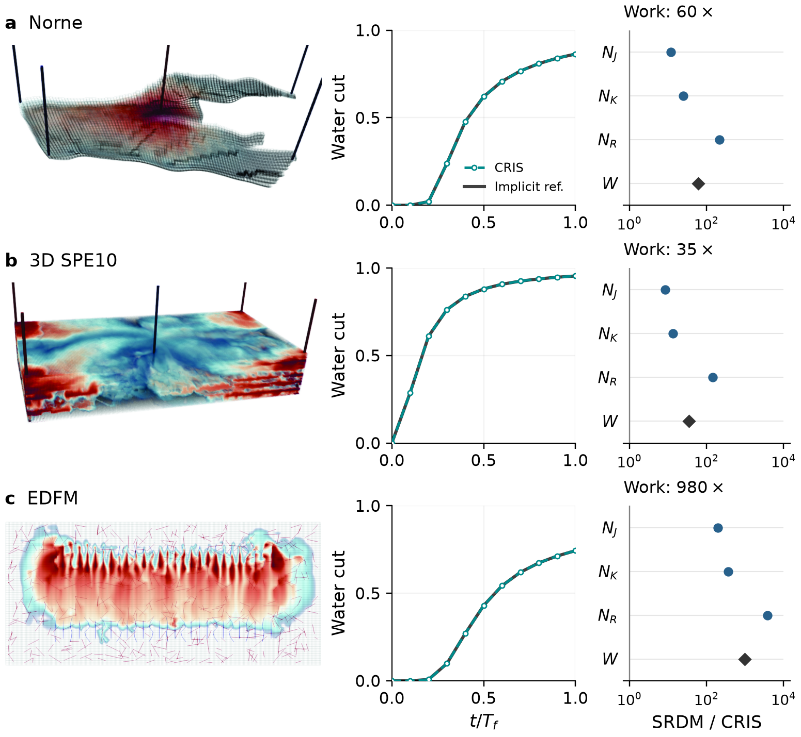
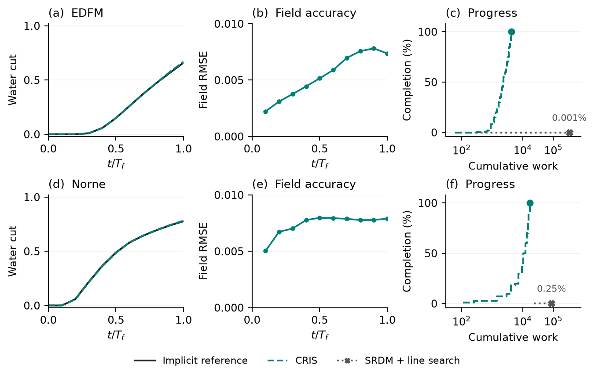
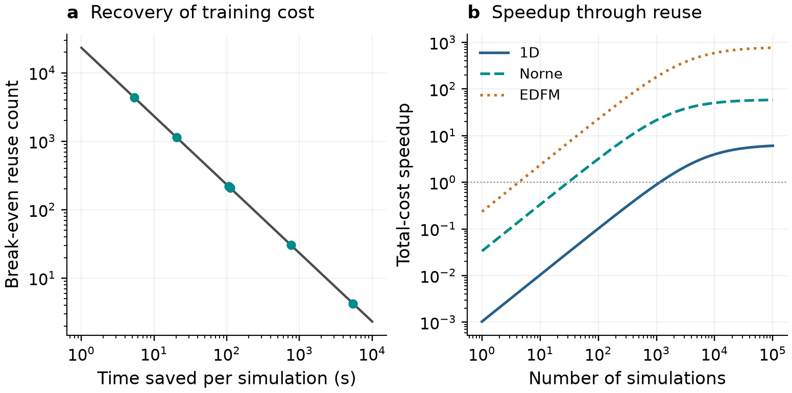

# CRIS

Code, trained models, benchmark inputs, and plotting data for the **Coupled Recurrence Inverse System (CRIS)** manuscript.

CRIS learns to solve small, recurring calculations in advance, then combines those learned building blocks to solve larger simulation problems. The same trained components can be reused across compatible cases with different geometries, scales, and flow paths. Technically, each component approximates the inverse of a local discrete equation; training uses local algebraic roots rather than global simulation labels.

## Selected results

One **1,361-parameter network serves seven transport benchmarks without retraining**, from one-dimensional flow to heterogeneous layers, a million-cell reservoir model, and fractured grids. These benchmarks share the same constitutive law. A separate inverse is prepared for the singular-endpoint law described below.

| Benchmark | Baseline process time | CRIS process time | Runtime speedup | Final saturation RMSE |
| --- | ---: | ---: | ---: | ---: |
| Fractured EDFM | 5,448.685 s | 6.887 s | **791.14×** | 2.762 × 10⁻⁵ |
| Norne | 778.231 s | 13.120 s | **59.31×** | 3.089 × 10⁻⁵ |
| 3D SPE10 — 1,122,000 cells | 21,107.042 s | 357.183 s | **59.09×** | 5.568 × 10⁻⁵ |

For EDFM, that is approximately **91 minutes to 7 seconds**. For million-cell SPE10, it is **5.86 hours to 5.95 minutes**. Accuracy is measured against independent implicit solutions of the original discrete equations on the CRIS run's accepted time grid.

Across all seven regular transport benchmarks, measured process-time speedups range from **2.25× to 791.14×**. These are sequential single-run observations under the reported solver configurations, not repeated-run timing estimates. Process times include startup, pressure solution, and I/O; offline training and reference construction are excluded.

### Reuse across complex geometries

The same quadratic-law inverse is used in all three cases. Production curves remain close to independent references. The right-hand panels show **solver-work ratios, not runtime speedups**: approximately 60×, 35×, and 980×. Work is the equal-weight sum of Newton updates, Krylov iterations, and residual evaluations, including failed attempts. Runtime ratios are reported separately in the table above.

The paired benchmarks use a common Newton–Krylov framework, discretization, pressure solution, time-step controls, and convergence tolerances. The original formulation (SRDM) uses a projected residual-based line search; CRIS uses full Newton updates. The large EDFM gain includes avoidance of costly rejected steps. Increasing the baseline's linear-iteration allowance reduces that gap, while CRIS retains approximately **12× lower solver work over the common comparison horizon** in the reported sensitivity test.

### Completion under singular endpoint behavior

A separately trained inverse for the singular-endpoint constitutive law is reused across both geometries. CRIS completes **100%** of both simulations without failed time steps. Within the tested budgets, safeguarded SRDM reaches approximately **0.001% of the EDFM horizon** and **0.25% of the Norne horizon**.

CRIS final saturation RMSE is **0.007365** for EDFM and **0.007894** for Norne. Water-cut RMSE at the saved report times is **0.361 and 0.300 percentage points**, respectively, against independent references. The baseline runs are incomplete, so their eventual completion cost and a full-horizon speedup are unknown.

### Recovering preparation cost through reuse

The selected regular-transport inverse requires **6.45 hours of measured optimization**. Savings from **five repetitions of the EDFM workload**, or **31 repetitions of Norne**, recover that charge. Charging all four quadratic-law optimization runs changes those counts to 14 and 100. This accounting excludes label generation, validation, export, and uninstrumented I/O from the offline cost.

Repeated savings are especially relevant to optimization and uncertainty assessment, where many compatible simulations are needed. Users adopting the released trained model incur no new training cost for that model, while integration and online simulation costs remain.

These results are reported in the ongoing manuscript's Tables 5.1, 5.2, 5.4, and 5.6 and Figures 5.13, 5.15, 5.20, and 5.23. The figures shown here are manuscript Figures 5.13, 5.23, and 5.20, respectively. Manuscript preparation is ongoing.

Public numerical records include the [runtime and accuracy table](Figures/fig4_transport/data/current_model_cost_table.csv), [singular-case completion ledger](Figures/figC1_impossible/main_degenerate_ledger.json), and [optimization-cost recovery table](Figures/fig5_local_inverse/amortization.csv).

## Getting started

- [Install dependencies and build](https://github.com/Akeemedes/CRIS/blob/main/docs/INSTALLATION.md).
- [Run the transport benchmarks with a pretrained inverse](https://github.com/Akeemedes/CRIS/blob/main/docs/SIMULATIONS.md).
- [Reproduce the mesh-refinement accuracy study](https://github.com/Akeemedes/CRIS/blob/main/training/twophasetransport/analysis/shock_refinement/README.md).
- [Train local inverses](https://github.com/Akeemedes/CRIS/blob/main/docs/TRAINING.md).
- [Recreate the figures from the supplied results](https://github.com/Akeemedes/CRIS/blob/main/docs/FIGURES.md).

The examples cover branch selection in Bratu and two-phase transport on one-dimensional, SPE10, Norne, and fractured EDFM grids. The transport benchmarks can be run without retraining. Replotting saved results requires Python but does not require compiling the simulator.

## Repository contents

| Directory | Contents |
| --- | --- |
| `src/` | Coupled transport solver, CRIS implementation, and numerical utilities |
| `training/` | Local-equation datasets, native trainers, trained checkpoints, and experiment scripts |
| `Figures/` | Benchmark case inputs, saved results, field images, and figure builders |
| `docs/` | Installation and reproduction instructions |

## License

The project is distributed under the [MIT license](https://github.com/Akeemedes/CRIS/blob/main/LICENSE). Bundled third-party code retains its own copyright and license notices.
